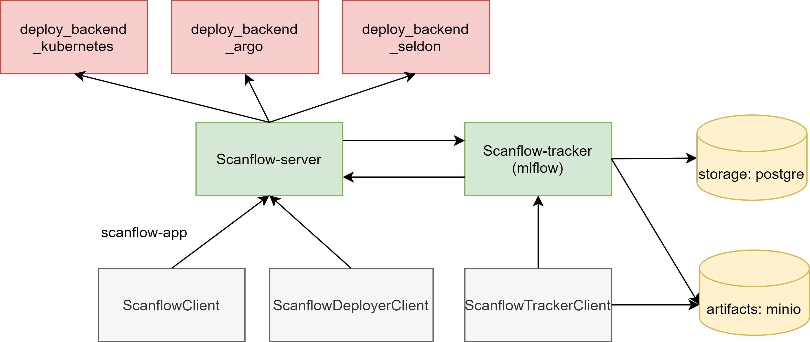

# Scanflow-Kubernetes: An MLOps Platform

Scanflow-Kubernetes is a platform to simplify MLOps. It originally supports deploying and operating on Kubernetes, but users can also extend it into other platforms. 

Scanflow is a high-level library that is built on top of Mlflow. It provides the ability to define workflows, build each executor of workflows and agents, and deploy/run the agents/workflows. In addition, it announces a framework for developing agents in order to manage and supervise workflows in both the ML training stage and the inference stage. 

Current components of Scanflow includes:

- **Scanflow Developing**(Scanflow Application): A format for teams defining workflows, agents and basic environment.

- **Scanflow Building**: An API to build Scanflow Application(each executor of workflows and agents as containers)

- **Scanflow Deploying**: An API to create a working environment for each team and deploy agents, also provides workflows running as batch workflows or deploying as online services

- **Scanflow Operating**(Scanflow Agent): A framework to develop agents. Provide an online multi-agent system to manage and supervise the workflows.

- **Scanflow Tracking**(Supported by MLflow): Mlflow provides an API to log parameters, artifacts, and models in machine learning experiments. We use mlflow as a database to track these information and transmit the information between teams.

## Scanflow Architecture

Scanflow Tracker is based on MLflow, MLflow logs can be recorded to local files as default. 

In our private platform, we config PostgreSQL as backend and Minio as artifact stores. For more information regarding how to config [Mlflow with remote tracking server backend and artifact stores](https://www.mlflow.org/docs/latest/tracking.html#scenario-4-mlflow-with-remote-tracking-server-backend-and-artifact-stores)

## Installing

Please check [installing](installer/Readme.md) for more details

## MLOps

## Tutorials

Please check the jupyter notebook for more details.

MNIST Project Tutorial: [mnist](tutorials/mnist/Readme.md)