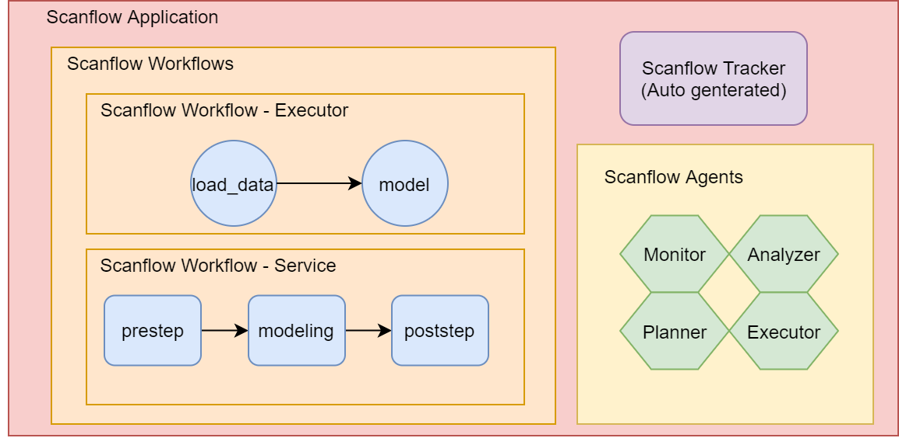

## Scanflow Architecture

Scanflow Tracker is based on MLflow, MLflow logs can be recorded to local files as default. 

In our private platform, we config PostgreSQL as backend and Minio as artifact stores. For more information regarding how to config [Mlflow with remote tracking server backend and artifact stores](https://www.mlflow.org/docs/latest/tracking.html#scenario-4-mlflow-with-remote-tracking-server-backend-and-artifact-stores)

## Scanflow Application

### Scanflow Workflow

#### Node

| node_type| Types |Reference|
|----------------|---------------|-------------|
|`Scanflow Executor`|  |  Argo task |
|`Scanflow Service`|  MODEL, TRANSFORMER   (TODO:) ROUTER, COMBINER, OUTLIER_DETECTOR | Seldon service |

#### Edge

| edge_type| Types |Feature|
|----------------|---------------|-------------|
|`Scanflow Dependency`|  | priority (int) |

### Scanflow Agent
Reactive agent, each agent contains sensors, rules and actuators.

Scanflow internally support template of four types of agents
- *Monitor*: Monitor the workflow
- *Analyzer*: Analyze the problem
- *Planner*: Make plan to solve problems 
- *Application-layer Executor*: Make actions on application layer

### Scanflow Tracker
Auto-generated, based-on mlflow
