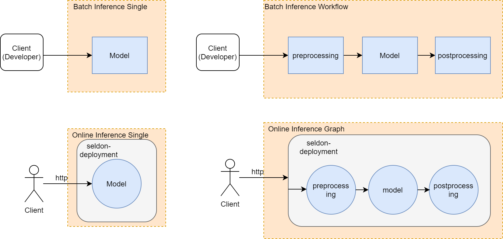

# mlperf Project Tutorial

## mlperf inference

```
git clone https://github.com/peiniliu/inference/tree/scanflow
```
In this tutorial, we use mlperf benchmark to test different inference scenarios that Scanflow could support.

In our inference scanflow version, we add more backend: 
1. tfserving: base64 encode decode support.
2. seldon: used for scanflow online inference.
3. tflocal(tf2): used for scanflow batch inference, tensorflow saved_model format support.

For example:
#### Based on MLPerf Inference (submission 9/18/2020)
Use the r0.7 branch (```git checkout r0.7```) if you want to submit or reproduce v0.7 results.

See the individual Readme files in the reference app for details.

| model | reference app | framework | dataset |
| ---- | ---- | ---- | ---- |
| [resnet50](https://github.com/bsc-scanflow/scanflow/tree/main/tutorials/mlperf/model/0) | [vision/classification_and_detection](https://github.com/peiniliu/inference/tree/master/vision/classification_and_detection) | tensorflow | imagenet2012 |


### DataScienceTeam (Training phase)

details in [mlperf-datascience.ipynb](training/mlperf-datascience.ipynb)

**NOTE**: Our cluster can not train resnet, so we download the resnet model. [resnet50 model download](https://github.com/bsc-scanflow/scanflow/tree/main/tutorials/mlperf/model/0)

### DataEngineerTeam (Inference phase)

#### Inference Scenarios




These scenarios can be tested directly using scripts that we provided inside modified [inference project (scenarios)](https://github.com/peiniliu/inference/tree/dev/vision/classification_and_detection/scenarios)

Tutorial of using Scanflow to implement these scenarios are described in [mlperf-dataengineer.ipynb](inference/mlperf-dataengineer.ipynb)

| scenarios | reference app | framework | model/dataset | mlperf backend|
| ---- | ---- | ---- | ---- | ---- |
| batch-inference-single | [scenarios/job-single](https://github.com/peiniliu/inference/tree/dev/vision/classification_and_detection/scenarios/job-single) | tensorflow | resnet/imagenet2012 | tflocal(tf2) |
| batch-inference-workflow | [scenarios/job-pipeline](https://github.com/peiniliu/inference/tree/dev/vision/classification_and_detection/scenarios/job-pipeline) | tensorflow | resnet/imagenet2012 | tflocal(tf2) |
| online-inference-single | [scenarios/service-single](https://github.com/peiniliu/inference/tree/dev/vision/classification_and_detection/scenarios/service-single) | tensorflow | resnet/imagenet2012 | seldon |
| online-inference-graph | [scenarios/service-graph](https://github.com/peiniliu/inference/tree/dev/vision/classification_and_detection/scenarios/service-graph) | tensorflow | resnet/imagenet2012 | seldon |

### Client 

details in [mlperf-client.ipynb](client/mlperf-client.ipynb)
