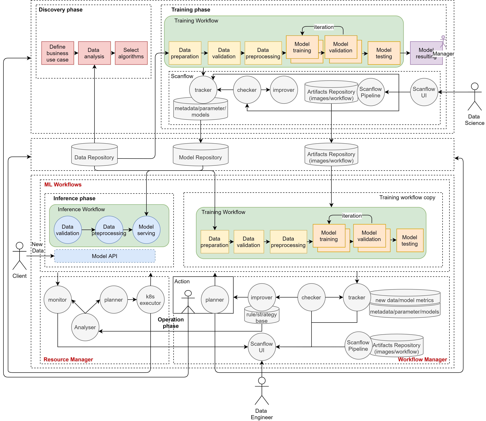
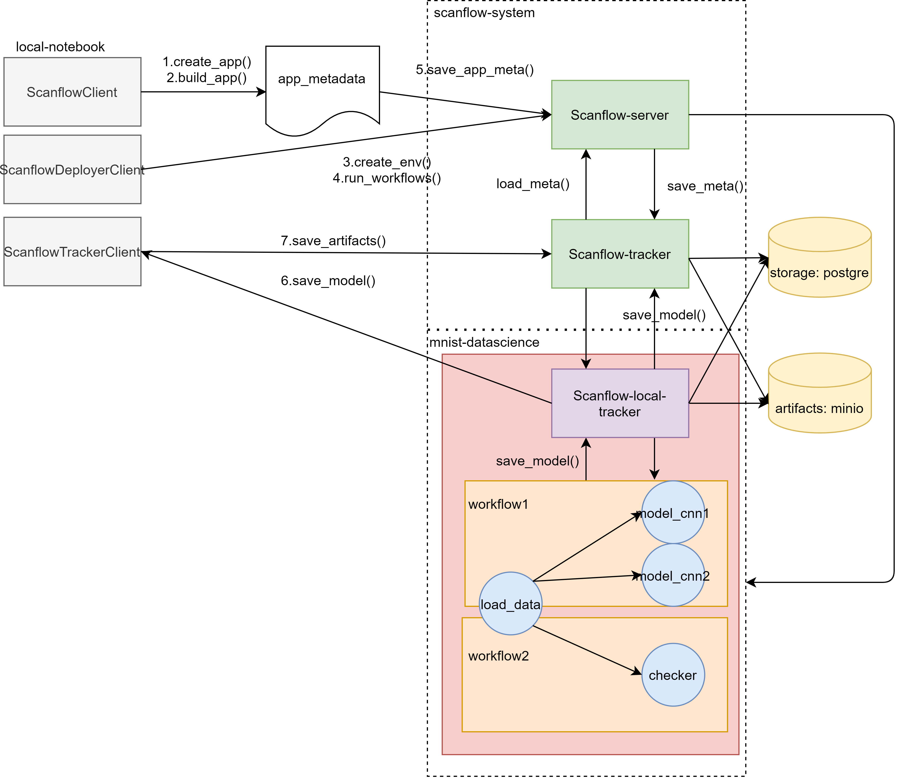

# MNIST Project Tutorial

## MLOps

### DataTeam (Discovery phase)

details in [mnist-data.ipynb](mnist-data.ipynb)

### DataScienceTeam (Training phase)

details in [mnist-datascience.ipynb](mnist-datascience.ipynb)

### DataEngineerTeam (Inference phase/Operation phase)

details in [mnist-dataengineer.ipynb](mnist-dataengineer.ipynb)

### Multi-agent System (Automatic Operation)

details in [mnist-MAS.ipynb](mnist-MAS.ipynb)
